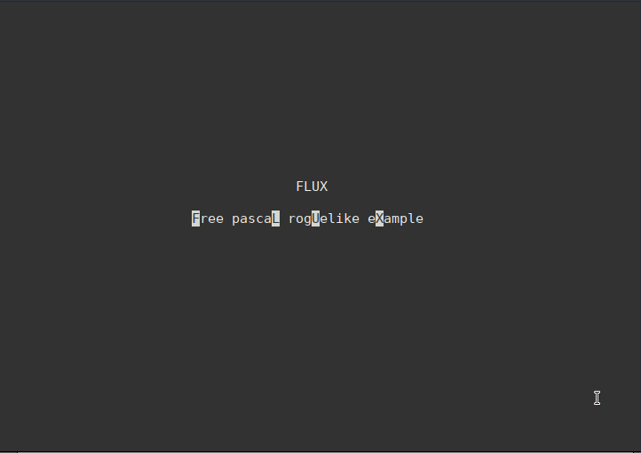

# FLUX
**F**ree pasca**L** rog**U**elike e**X**ample

FLUX is a small hobby project to create a basic roguelike that runs in a text terminal. It includes the following basic features;

 - A randomly generated dungeon
 - Should run on GNU/Linux and Windows
 - No third-party libraries
 - Small, native binary under 1mb in size

The code is released into the public domain, feel free to use it or modify it in any way you choose.

## compilation  
The source code can be compiled from the command line by navigating to the source directory and entering the following command;  

    fpc flux

This will compile all units and create an executable program with the same name.
## wiki
The [wiki](https://github.com/cyberfilth/FLUX/wiki) contains documentation for all units in FLUX.

## tags
The tags file contains an index of procedures and functions found in the source code. This file will automatically be loaded when viewing a source file in Vim, allowing you to jump straight to a function when you encounter it in the code.  
This file was generated with the Exuberant Ctags tool.
